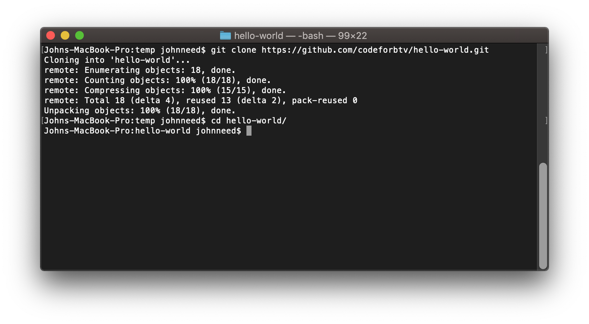

# Clone A Repository

Let's say you want to contribute to one of Code for BTV's projects.  Most likely there will already be a repository.  In that case you'll need to use the clone command to setup your local repository. 

To clone a respository you need it's URL.  Fortunately GitHub makes this simple.  On the main respository page, click the 'Clone or download' button and then click the 'copy to clipboard' icon button. You should now have the URL in your clipboard.


To clone the repo, up a terminal and navigate to where you want your local repository to live.  Then type `git clone` and paste the URL you just copied.  

```bash
git clone https://github.com/codeforbtv/hello-world.git
```

Of course the URL will match which ever repository you are cloning.



cd into your repo and you are ready to start coding.
